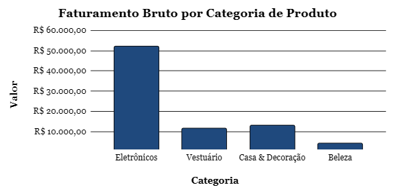

# ecommerce-financial-intelligence
Modelagem de BI para e-commerce e financeiro: análise de Lucro Líquido, Ticket Médio e eficiência de canais de aquisição por categoria de produto.

# 📊 Inteligência Financeira & Comercial para E-commerce

## 💡 Sobre o Projeto
Este projeto analisa a lucratividade real de uma operação de e-commerce dividida por categorias de produto. Em vez de focar apenas no faturamento bruto, o modelo realiza uma auditoria comercial que desconta o **CMV** (Custo de Mercadoria Vendida) e o **CAC** (Custo de Aquisição de Clientes) de cada pedido para encontrar o lucro real e a eficiência de mídia.

---

## 🖼️ Interface Visual e KPIs Consolidados
*Abaixo está a demonstração visual do painel estratégico desenvolvido para suporte à tomada de decisão de diretores e gerentes de operação.*

> 💡 **Dica de Visualização:** O painel centraliza os blocos de KPIs superiores para acompanhamento rápido de saúde financeira, seguido pela tabela de detalhamento setorial e o gráfico comparativo de receita.

---

## 🛠️ Estrutura do Modelo

O projeto foi estruturado em uma planilha eletrônica profissional dividida em duas abas integradas:

### 1. Base de Dados (`Base_Vendas`)
Tabela com o histórico de transações e pedidos da operação. Possui inteligência automatizada e proteção para que novas linhas sejam adicionadas sem quebrar a lógica do negócio:
* **Cálculo de Lucro:** Desconto direto dos custos sobre a receita do pedido (`=D2 - E2 - F2`).
* **Tratamento de Erros:** Uso de funções lógicas para garantir que o painel não exiba mensagens de erro caso existam linhas em branco.

### 2. Painel Consolidado (`Dashboard_Comercial`)
A interface visual com os grandes números e tabelas de apoio para tomada de decisão:
* **Cards de Performance:** Exibição dos indicadores principais da operação.
* **Análise por Categoria:** Tabelas que agrupam os dados de *Eletrônicos, Vestuário, Casa & Decoração e Beleza* usando critérios dinâmicos.
* **Gráfico Nativo:** Visualização em colunas para identificar rapidamente quais setores trazem o maior retorno financeiro.

---

## 📐 Ferramentas e Fórmulas Aplicadas
Para criar a automação do painel sem precisar de processos manuais, o modelo utiliza as seguintes funções nativas (compatíveis com Excel e Google Sheets):

* **`SOMASES` e `MÉDIASES` (Inteligência Setorial):** Agrupam e filtram o faturamento e o lucro de cada categoria de produto de forma automática, permitindo comparar o desempenho de cada setor isoladamente.
* **`SEERRO` (Segurança de Dados):** Protege a planilha contra mensagens de erro do sistema (como o `#DIV/0!`). Isso garante que, mesmo se novas linhas forem adicionadas sem dados, o layout continue limpo e profissional.
* **`SOMA` e `MÉDIA` (Métricas Gerais):** Consolidam a receita total da operação e o comportamento de compra dos clientes (Ticket Médio) em tempo real.
* **`CONT.VALORES` (Volume Operacional):** Realiza a contagem automatizada de todos os pedidos ativos registrados na base.

---

## 📈 Indicadores Chave (KPIs)
* **Volume de Vendas:** Quantidade de pedidos fechados.
* **Ticket Médio:** Valor médio gasto em cada compra.
* **Lucro Líquido Real:** O valor final que sobra no caixa após pagar o produto e o marketing.
* **ROI de Marketing:** Retorno sobre o investimento feito em anúncios.

---

## 👤 Créditos e Desenvolvimento
* **Desenvolvido por:** [Kauan Benfica](https://www.linkedin.com/in/kauan-benfica-03a8852a6)
* **Foco do Projeto:** Portfólio de Inteligência Comercial, Análise de Dados e Finanças Operacionais.
